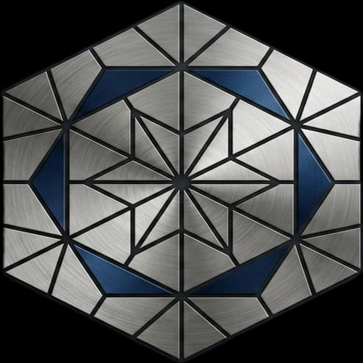

# Astrolabe

<div align="center">
  
  <h3>The Open-Source, AI-Native IDE with Built-In Local GPU Inference</h3>

  [](LICENSE)
  [](https://www.rust-lang.org/)
  [](https://nodejs.org/)
  []()
</div>

---

> **Astrolabe makes private local AI development as simple as using a modern cloud AI editor—without requiring a CLI, subscription, or separate model-management workflow.**

---

## The Problem

- **Local AI coding is too fragmented.** Developers must combine an IDE, a model runtime, a model downloader, an inference server, and an AI coding extension just to start coding with a local model.
- **The setup is too CLI-heavy.** Users often need terminal commands, configuration files, endpoint URLs, model names, ports, environment variables, and manual troubleshooting.
- **Model management and coding are disconnected.** Downloading a model in one application and using it from another creates unnecessary friction and confusion.
- **Models are difficult to configure correctly.** Users must understand model formats, quantization, context length, memory limits, GPU settings, tool-calling support, and exact model identifiers.
- **Existing tools can lock users into one workflow.** Developers may prefer different coding harnesses—such as Astrolabe Native, Claude Code, Continue, Aider, OpenCode, or custom agents—but switching between them is difficult.
- **Context selection is inconsistent.** Users need an easy way to choose the workspace, files, folders, code selection, Git diff, diagnostics, and other context given to the model.
- **Privacy requires too much compromise.** Developers who want local and private inference often have to sacrifice the convenience and polish of modern AI coding editors.
- **Local models should not require cloud subscriptions.** Users should be able to download open models, run them on their own hardware, and avoid per-request API costs.

---

## What Astrolabe Solves

- **Unified Open-Source GUI**: One clean interface for downloading, managing, loading, and running local models directly inside your code editor.
- **One-Click Daemon Controls**: Start, stop, and inspect the local high-speed inference daemon with a visual button instead of terminal commands.
- **Visual Model Hardware Tuning**: Visually configure context length, GPU offload layers, CPU thread pools, and max generation limits with real-time VRAM telemetry.
- **Unified Workspace & Model Hub**: Built-in Hugging Face model search and downloader integrated directly with your active coding workspace.
- **Machine HealthGuard™ Protection**: Built-in thermal monitoring and OOM prevention guards keep your hardware safe during intense local generation.
- **Pluggable Coding Harness Architecture**: Choose your preferred agent harness instead of being locked into a single built-in workflow. *(Under active development)*
- **100% Private & Subscription-Free**: Download the IDE, download a model, press Start, choose your context, and start coding privately with zero monthly fees.

---

## Core Pillars & Hardware Acceleration

### 1. Embedded Native AI Engine (`exovon-daemon`)
Astrolabe embeds a high-performance local inference server written in **Rust** with native C++ acceleration bindings:
* **NVIDIA RTX / CUDA Users**: High-throughput inference via **SGLang** with RadixAttention and FlashInfer acceleration.
* **AMD Radeon, Intel Arc & Apple Silicon / iGPUs**: High-performance **Vulkan** compute pipeline with direct VRAM layer offloading.
* **Universal CPU Fallback**: Automatically degrades to optimized CPU matrix kernels (**AVX2**, **AVX-512**, **ARM NEON**) on machines or VMs without dedicated GPU drivers.
* **Direct GGUF Quantization Support**: Native handling of Q4_K_M, Q8_0, IQ3_M, and modern mixed-precision weights.

### 2. Machine HealthGuard™ (Hardware & Thermal Safety)
Running multi-billion parameter LLMs locally can push hardware to its limits. Astrolabe includes built-in hardware protection:
* **Live Thermal Monitoring**: Continuous tracking of CPU & GPU core temperatures with color-coded safety indicators.
* **Thermal Throttling Guard**: Automatically pauses or regulates batch generation if thermal thresholds are reached, protecting laptops and compact rigs from overheating.
* **OOM (Out-of-Memory) Prevention**: Real-time VRAM allocation estimation before loading models to prevent system freezes and kernel panics.
* **Status Bar Health Telemetry**: Instant visibility of CPU load, RAM usage, and active engine status directly in the bottom status bar.

### 3. Autonomous Coding Agent (Exovon Agent)
* **Full Plan-Inspect-Execute-Verify Loop**: Creates multi-file implementation plans, inspects repositories, applies targeted code patches, and runs test suites autonomously.
* **100% BYOK & Cloud Fallback**: Run completely offline on local GGUF models, or plug in your own API keys for **Google Gemini**, **Anthropic Claude**, **OpenAI**, **DeepSeek**, or **Zhipu GLM**.

### 4. Astrolabe Motion Studio (AMS) `[Pre-Development Phase]`
* Integrated visual timeline & UI animation studio powered by Theatre.js.
* Live 3D viewport, DOM tree inspection, and bidirectional visual-to-code compilation.

### 5. Custom Glassmorphism UI & Ergonomics
* Custom frosted glass styling, backdrop blur, distraction-free layouts, and custom theme presets.

---

## Supported Hardware & Models

| Hardware Target | Compute Backend | Supported Accelerators |
| :--- | :--- | :--- |
| **NVIDIA Dedicated GPUs** | **SGLang / CUDA** | RTX 30/40/50 series, A100/H100, Quadro |
| **AMD & Intel GPUs** | **Vulkan** | AMD Radeon (RDNA 1/2/3/4), 780M/760M iGPUs, Intel Arc |
| **Apple Silicon** | **Metal / Accelerate** | Apple M1, M2, M3, M4 (Pro / Max / Ultra) |
| **Any CPU / VM / Cloud** | **CPU Kernels** | x86_64 (AVX2 / AVX-512), aarch64 (NEON) |

**Compatible Model Architectures (GGUF)**:
Gemma 4 / 3, Qwen 2.5 / Coder, DeepSeek R1 / V3, Llama 3.1 / 3.3, Mistral, and any standard GGUF model from Hugging Face.

---

## Monorepo Architecture

```text
astrolabe/                                      <-- Root Repository
├── src/                                        <-- VSCodium Core Shell & Glass UI Patches
├── daemon/                                     <-- exovon-daemon (Rust / Vulkan / SGLang Engine)
├── apps/
│   └── astrolabe-motion-studio/                <-- Visual Motion Studio (Theatre.js) [Pre-Dev]
├── src/stable/extensions/
│   └── exovonhub/                              <-- AI Agent, Hub UI & Local Model Manager
├── packages/
│   └── exovon-sdk/                             <-- Core TypeScript SDK & Tool Call Parser
├── patches/                                    <-- Source patches for Glass UI & Branding
└── build-all-astrolabe.sh                      <-- Unified All-In-One compilation script
```

---

## Building from Source

### Prerequisites
* **Git** & **Node.js** (v20 or newer)
* **Rust** & **Cargo** (1.80+)
* **CMake** & C/C++ Compiler (`gcc` / `clang` / MSVC)
* **Vulkan SDK** / Vulkan drivers (Optional, for GPU offload)

### 1. Clone the Repository
```bash
git clone https://github.com/exovon/astrolabe.git
cd astrolabe
```

### 2. Compile All Subsystems
```bash
./build-all-astrolabe.sh
```

### 3. Package the Standalone IDE Distribution
```bash
./build.sh
```

The compiled standalone executable and packages (`.AppImage`, `.deb`, or `.tar.gz`) will be generated ready for execution.

---

## Privacy & Security Guarantee

* **No Code Tracking**: Your source code, diffs, and prompt interactions are never logged, tracked, or sent to telemetry servers.
* **No Hardcoded Keys**: All cloud credentials use OS keychain storage or environment variables.
* **Zero Cloud Lock-in**: The local daemon runs completely air-gapped on `127.0.0.1:47990` with no internet connection required.

---

## Contributing & Community

Contributions are warmly welcome! Whether you are interested in expanding the local Rust inference engine, adding support for new agent harnesses, or enhancing Motion Studio:

1. Fork the repository.
2. Create your feature branch (`git checkout -b feat/my-new-feature`).
3. Commit your changes (`git commit -m 'feat: add support for new feature'`).
4. Push to the branch (`git push origin feat/my-new-feature`).
5. Open a Pull Request.

---

## License

Astrolabe is released under the **[MIT License](LICENSE)**.
