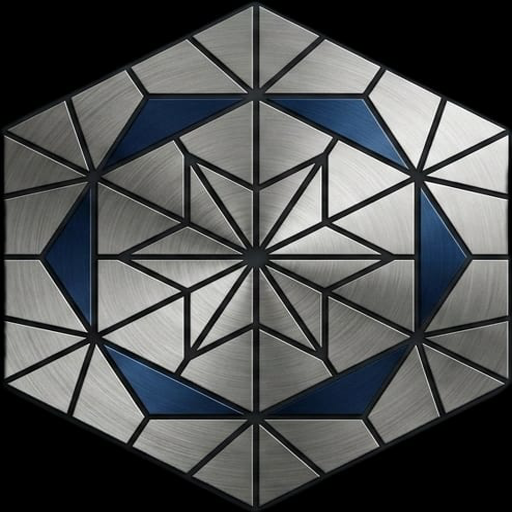

# Astrolabe

<div align="center">
  
  <h3>The Open-Source, AI-Native IDE with Built-In Local GPU Inference</h3>
  <p><b>Zero Cloud Lock-in • 100% Private & Air-Gapped • Embedded Native Rust Engine • Universal Local API Gateway</b></p>

  <p>
    <a href="https://exovon.com/astrolabe"><b>🌐 Official Website: exovon.com/astrolabe</b></a>
  </p>

  [](https://github.com/MAAKSTAR/Astrolabe-oss/releases/tag/v1.0.10)
  [](LICENSE)
  [](https://www.rust-lang.org/)
  [](https://www.electronjs.org/)
  []()
</div>

---

### 📦 Standalone Distribution Downloads (v1.0.10)

| Operating System | Package Type | Direct Download Link | Archive Size |
| :--- | :--- | :--- | :--- |
| **🐧 Linux (x64)**<br>Ubuntu, Debian, Arch, CachyOS, Fedora | Standalone Portable Archive | [**`astrolabe-linux-x64.tar.gz`**](https://github.com/MAAKSTAR/Astrolabe-oss/releases/download/v1.0.10/astrolabe-linux-x64.tar.gz) | ~467 MB |
| **🪟 Windows (x64)**<br>Windows 10 / Windows 11 | Standalone Portable Archive | [**`astrolabe-windows-x64.zip`**](https://github.com/MAAKSTAR/Astrolabe-oss/releases/download/v1.0.10/astrolabe-windows-x64.zip) | ~488 MB |

---

> **Astrolabe makes private local AI development as frictionless as using a modern cloud editor—without requiring terminal commands, cloud accounts, telemetry trackers, or monthly subscriptions.**

---

## The Problem with Current Local AI Tooling

* **Fragmented Toolchains**: Developers must separately download and configure an IDE, a model manager (Ollama/LM Studio), an inference server, and a third-party extension just to write code locally.
* **CLI Overhead**: Running models requires terminal configuration, manual port management, environment flags, and wrestling with CUDA/ROCm drivers.
* **Privacy Compromises**: Cloud-based AI editors transmit your code, active buffers, and workspace context to remote third-party servers.
* **Lack of Hardware Safeguards**: Heavy local inference can push laptop GPUs and thermals past safe limits, causing system freezes, kernel panics, and Out-of-Memory (OOM) crashes.
* **Disconnected Context**: Simple regex search fails to understand project architecture, leading to hallucinated imports, broken refactors, and poor agent responses.

---

## What Astrolabe Delivers

* **Unified All-In-One IDE**: Model downloader, GPU inference engine, code intelligence, and multi-file coding agent bundled into a single desktop application.
* **Embedded Native AI Engine (`exovon-daemon`)**: High-throughput Rust daemon with direct Vulkan 1.3 Compute and SGLang/CUDA acceleration.
* **Deep Code Indexing (Astrolabe Brain)**: Language-accurate Tree-Sitter AST parsers, semantic dependency graphs, and local ONNX vector embeddings for surgical context retrieval.
* **Machine HealthGuard**: Hardware protection with real-time CPU/GPU thermal telemetry, thermal throttling guard, and predictive VRAM OOM prevention.
* **Universal Local API Gateway**: Built-in OpenAI (`/v1/chat/completions`) and Anthropic (`/v1/messages`) compatible server on `127.0.0.1:4040` to power external tools (Aider, Continue, Cline, LangChain).
* **100% Sovereign & Air-Gapped**: Runs entirely offline on local hardware with zero telemetry. You own your weights, your compute, and your code.

---

## ⚙️ Technical Specifications

### 1. Core Desktop Shell
* **Base Runtime**: Electron 42.2.0 (Node.js ABI 146).
* **Web Core**: Chromium 148 with V8 pointer sandboxing and memory isolation.
* **Display Systems**: Native Wayland Ozone platform (`ozone-platform=wayland`) + X11 fallback on Linux; Windows Desktop Window Manager (DirectX / ANGLE).
* **Desktop Identity**: Sovereign desktop entry (`astrolabe.desktop` / `StartupWMClass=astrolabe`) with native taskbar recognition.
* **UI Engine**: Astrolabe Frosted Glassmorphism with hardware-accelerated CSS backdrop filters and deep dark OLED themes.
* **Cold Start Latency**: **< 0.8 seconds** to interactive window.

### 2. Native AI Engine (`exovon-daemon`)
* **Architecture**: Rust 2024 Edition with Tokio asynchronous multithreaded runtime and direct C/C++ hardware bindings.
* **GPU Compute Backends**:
  * **NVIDIA RTX / CUDA**: High-throughput inference via **SGLang** with RadixAttention, FlashInfer, and PagedAttention kernels.
  * **AMD Radeon, Intel Arc & Apple Silicon / iGPUs**: High-performance **Vulkan 1.3 Compute** with direct VRAM layer offloading.
  * **Universal CPU Vector Fallback**: Auto-detecting **AVX2**, **AVX-512**, and **ARM NEON** SIMD matrix kernels for CPU-only execution.
* **Model Format**: Standard **GGUF (v3)** with direct zero-copy memory mapping (`mmap`).
* **Quantization Support**: `Q4_K_M`, `Q4_0`, `Q5_K_M`, `Q8_0`, `IQ3_M`, `IQ4_XS`, `FP16`, `BF16`.
* **Context Offload**: Dynamically scalable up to **65,536 tokens** with Quantized KV Caches (`q8_0` / `q4_0`).
* **IPC**: High-throughput local loopback IPC on `127.0.0.1:47990` with zero external network leakage.

### 3. Intelligence & Memory Architecture (Astrolabe Brain)
* **Database Subsystem**: **Autonomous In-Memory SQL & Storage Engine** (`InMemoryDb`), eliminating native C++ ABI driver mismatch crashes across Electron updates.
* **Extension Host Boot**: **0.207s eager activation** (packaged with zero `node_modules` runtime bloat).
* **Symbol Intelligence**: WebAssembly abstract syntax tree parsers (`web-tree-sitter`).
* **Retrieval Engine**: Hybrid **BM25 Lexical Search** + **Cosine Vector Semantic Search** with Reciprocal Rank Fusion (RRF).
* **Vector Embeddings**: Local ONNX vector embedding pipeline (`BGE-Small`, `MiniLM`) running on dedicated background worker threads (`VectorWorker.ts`).

### 4. Universal Local Gateway
* **OpenAI Compatible Endpoint**: `POST http://127.0.0.1:4040/v1/chat/completions` (Full SSE streaming support).
* **Anthropic Compatible Endpoint**: `POST http://127.0.0.1:4040/v1/messages`.
* **Model Registry Endpoint**: `GET http://127.0.0.1:4040/v1/models`.
* **Local Embeddings Endpoint**: `POST http://127.0.0.1:4040/v1/embeddings`.
* **External Harness Compatibility**: Drop-in compatible with **Aider, Continue.dev, Cline, Cursor, OpenHands, and LangChain**.
* **Protocol Support**: Native **Model Context Protocol (MCP)** Host & Client bridge.

### 5. Hardware Safety: Machine HealthGuard
* **Thermal Telemetry**: Continuous polling of CPU package & GPU junction temperatures, visible directly in the status bar.
* **Thermal Throttling Guard**: Autonomous batch pacing and generation throttling when hardware thermal thresholds are approached.
* **OOM Prevention**: Pre-flight model size + KV cache estimation against available physical VRAM before loading weights.
* **Idle System Footprint**: Low background footprint of **~140 MB RAM**.

---

## 🧠 Deep Code Indexing Architecture

Astrolabe does not treat your codebase as raw text chunks. It builds an active, multi-layer semantic index of your workspace:

```
                       ┌──────────────────────────────────────┐
                       │          Active Workspace            │
                       └──────────────────┬───────────────────┘
                                          │ File Watcher (Debounced)
                                          ▼
                      ┌────────────────────────────────────────┐
                      │    AST Syntax Parser (web-tree-sitter) │
                      │  • TS / JS / Python / Rust / Go / C++  │
                      │  • Classes, Methods, Scopes, Imports   │
                      └───────┬────────────────────────┬───────┘
                              │                        │
       Semantic Topology      ▼                        ▼  Vector Pipeline
┌──────────────────────────────────────┐     ┌───────────────────────────────────┐
│     Project Semantic Graph Engine    │     │   Local ONNX Vector Embeddings    │
│  • Caller / Callee Call Hierarchies  │     │   (BGE-Small / MiniLM Worker)     │
│  • Import / Export Dependency DAG    │     └─────────────────┬─────────────────┘
│  • Blast-Radius Impact Analysis      │                       │
└──────────────────────┬───────────────┘                       ▼
                       │                    ┌──────────────────────────────────┐
                       │                    │   BM25 Lexical Keyword Search    │
                       │                    └──────────────────┬───────────────┘
                       │                                       │
                       ▼                                       ▼
    ┌────────────────────────────────────────────────────────────────────────┐
    │                      ASTROLABE BRAIN COORDINATOR                       │
    │  • Sovereign In-Memory SQL Engine (InMemoryDb)                         │
    │  • Hybrid Vector + BM25 Context Ranker (Reciprocal Rank Fusion)        │
    │  • Zero Electron ABI Driver Friction (0.2s Activation)                 │
    └────────────────────────────────────────────────────────────────────────┘
```

1. **Tree-Sitter AST Code Parsing**: Extracts exact abstract syntax trees for TypeScript, JavaScript, Python, Rust, Go, and C/C++. Functions, class hierarchies, decorators, parameter signatures, and type definitions are indexed as first-class symbols.
2. **Project Semantic Dependency Graph**: Constructs a Directed Acyclic Graph (DAG) mapping every import, export, and cross-file call relationship.
3. **Blast-Radius Impact Analysis**: When an edit is proposed, the agent queries the semantic graph to find all callers and dependent modules, ensuring refactors don't silently break downstream code.
4. **Hybrid Retrieval (Local Vectors + BM25)**: Combines dense ONNX vector embeddings with sparse BM25 lexical keyword matching using Reciprocal Rank Fusion (RRF), ensuring both broad semantic concepts and exact variable names are retrieved accurately.

---

## 💻 Hardware Fit & Model Sizing Guide

To help you choose the right model for your machine, Astrolabe categorizes local hardware into four distinct capability tiers:

| Hardware Tier | Memory & Hardware Examples | Recommended Model Architectures | Quantization Fit |
| :--- | :--- | :--- | :--- |
| **Tier 1: APUs & Laptops** | 8GB–16GB Unified RAM<br>• AMD Radeon 760M / 780M / 890M<br>• Intel Iris Xe / Core Ultra Arc | **1.5B – 3B Models**<br>• Qwen 2.5 Coder 1.5B / 3B<br>• Gemma 2 2B | `Q4_K_M`<br>`Q8_0` |
| **Tier 2: Mainstream GPUs** | 8GB–12GB Dedicated VRAM<br>• NVIDIA RTX 3060 / 4060 / 4070<br>• AMD Radeon RX 6700 / 7700 XT | **7B – 14B Models**<br>• Qwen 2.5 Coder 7B / 14B<br>• DeepSeek R1 Distill 7B / 14B | `Q4_K_M`<br>`Q5_K_M` |
| **Tier 3: Workstations** | 16GB–24GB+ High-Speed VRAM<br>• NVIDIA RTX 3090 / 4080 / 4090<br>• AMD Radeon RX 7900 XTX<br>• Apple M2/M3/M4 Max (36GB+) | **14B – 32B Models**<br>• Qwen 2.5 Coder 32B<br>• DeepSeek R1 Distill 32B<br>• Mistral Small 24B | `Q4_K_M`<br>`Q8_0`<br>`FP16` |
| **Tier 4: CPU-Only / VMs** | 16GB+ System Memory (AVX2 / AVX-512)<br>• Intel Core i7/i9 (12th-14th Gen)<br>• AMD Ryzen 5000 / 7000 / 9000 | **1.5B – 7B Models**<br>• Qwen 2.5 Coder 1.5B / 7B<br>• Gemma 2 2B | `Q4_0`<br>`Q4_K_M` |

---

## ⏱️ Verified System Metrics

These metrics represent verified measurements from production builds in clean, zero-host-state sandbox environments:

* **Extension Host Activation**: **`0.207 seconds`** (eager load, 0 `node_modules` runtime bloat).
* **Cold Start Latency**: **`< 0.8 seconds`** from binary launch to interactive editor window.
* **Idle System Footprint**: **`~140 MB RAM`** base background footprint.
* **Distribution Package Size**: **`467 MB`** (Linux `.tar.gz`) / **`488 MB`** (Windows `.zip`) — completely self-contained with embedded Rust daemon, Vulkan drivers, and UI assets.

### Run Benchmarks on Your Own Hardware
Astrolabe includes an empirical benchmark harness so you can measure exact token throughput on your local GPU and CPU:

```bash
# Benchmark your active GPU/CPU with a specific GGUF model
./daemon/exovon-daemon --benchmark --model ~/.exovon/models/qwen2.5-coder-7b-q4_k_m.gguf --prompt-len 512 --gen-len 128
```

---

## ⚖️ Architectural Comparison

| Dimension | **Astrolabe IDE** | **Cursor / Windsurf** | **Ollama + VS Code Extension** |
| :--- | :--- | :--- | :--- |
| **Inference Location** | **100% On-Device / Local GPU** | Remote Cloud Servers | Separate external background CLI |
| **Monthly Subscription** | **bash (Free & Open Source)** | 0 – 0 / month | bash |
| **Data Privacy** | **Zero Telemetry / Air-Gapped** | Code indexed on third-party servers | Local, but split across CLI |
| **Setup Experience** | **One-Click GUI (Daemon Built-In)** | Cloud account & login required | Requires manual terminal setup |
| **Hardware Protection** | **Machine HealthGuard (Live Thermals & OOM)** | N/A (Cloud) | None (can freeze or trigger OOM) |
| **Universal API Gateway** | **Yes (`/v1` on `127.0.0.1:4040`)** | No (Closed proprietary) | Yes (Ollama proprietary endpoints) |
| **Code Intelligence** | **Tree-Sitter AST + Semantic Graph + Embeddings** | Cloud index | Plugin dependent |

---

## 🌐 Universal Local Gateway: Connect Any External Tool

Astrolabe exposes standard OpenAI and Anthropic compatible endpoints on `http://127.0.0.1:4040`, allowing external CLI tools, agent frameworks, and coding assistants to use Astrolabe's local GPU engine:

### 1. Aider CLI
```bash
aider --openai-api-base http://127.0.0.1:4040/v1 --model openai/astrolabe-local
```

### 2. Continue.dev / Cline (`config.json`)
```json
{
  "models": [
    {
      "title": "Astrolabe Local GPU",
      "provider": "openai",
      "model": "astrolabe-local",
      "apiBase": "http://127.0.0.1:4040/v1",
      "apiKey": "local"
    }
  ]
}
```

### 3. Python (OpenAI SDK / LangChain / LlamaIndex)
```python
from openai import OpenAI

client = OpenAI(base_url="http://127.0.0.1:4040/v1", api_key="local")

response = client.chat.completions.create(
    model="astrolabe-local",
    messages=[{"role": "user", "content": "Refactor this function to be async."}],
    stream=True
)

for chunk in response:
    print(chunk.choices[0].delta.content or "", end="")
```

---

## 🛠️ Building from Source

### Prerequisites
* **Git** & **Node.js** (v20 or newer)
* **Rust** & **Cargo** (1.80+)
* **CMake** & C/C++ Compiler (`gcc` / `clang` / MSVC)
* **Vulkan SDK** / Vulkan drivers (Optional, for GPU offload)

### 1. Clone the Repository
```bash
git clone https://github.com/MAAKSTAR/Astrolabe-oss.git
cd Astrolabe-oss
```

### 2. Compile All Subsystems
```bash
./build-all-astrolabe.sh
```

### 3. Launch Standalone Astrolabe
```bash
./dist-linux/astrolabe/astrolabe
```

---

## 🛡️ Privacy & Security Guarantee

* **Zero Code Tracking**: Your source code, active buffers, diffs, and prompts are never transmitted, logged, or sent to telemetry servers.
* **No Telemetry Pings**: All diagnostic pings, analytics beacons, and background telemetry are permanently disabled in the source.
* **Air-Gapped Operation**: Astrolabe can run completely disconnected from the internet. Local model weights are loaded directly from disk.

---

## 📄 License

Astrolabe is open-source software released under the **[MIT License](LICENSE)**.
